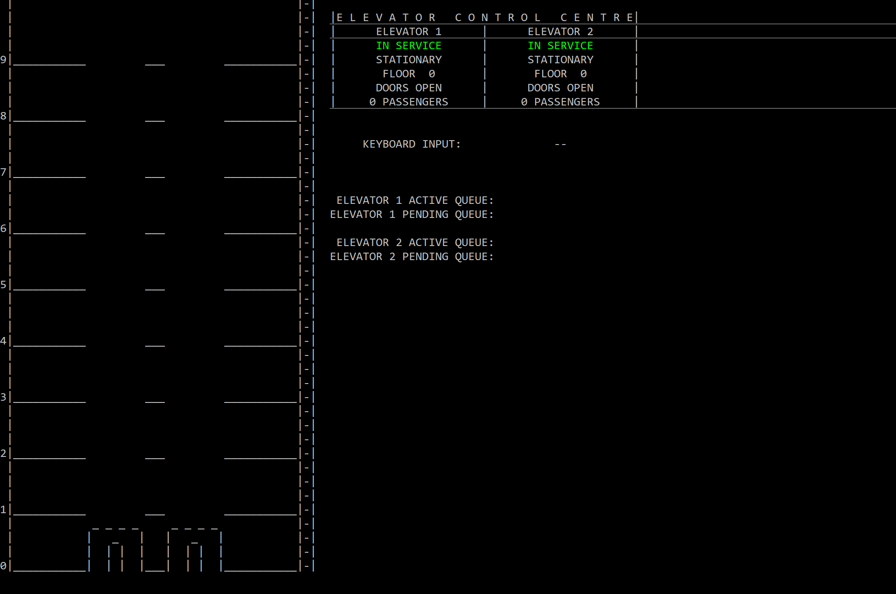

# ConsoleElevator
This is a multi-threaded double elevator system that simulates the functionality of an elevator implementation in a building. These elevators respond to request made inside or outside the elevator to transport passengers up and down. The system also includes fault simulation, a comprehensive UI displaying an elevator’s current floor, direction, door status and general status. 

The system is constructed using multithreads and different techniques like mutexes, pipelines, data pools and semaphores to access resources with synchronized calls.

The Elevator system can be accessed from user input via keyboard inputs or it can also respond to randomly simulated passengers requesting an elevator from a given floor and requesting subsequent destination floors. 

## Elevator Design
The following is a high-level overview of the system.

* **Dispatcher** - Deciphers the logic to send signals to elevators according to their current state through mailbox/queues
* **IO** - receives and validates user input to operate the elevator system and sends a command to dispatcher through a pipeline. This process is also in charge of drawing the interface shown
* **Elevator 1, Elevator 2** - Standalone processes that interpret signals received from the dispatcher and store their respective information in independent data pools
* **ACtive Passengers** - Instances of passengers that spawn randomly to request an elevator

## Presentational Images
The following section will present some snapshots of the system in motion

#### Idle State

#### Elevators Operating

#### Elevator Out of Service

#### Active Objects Calling Elevators

